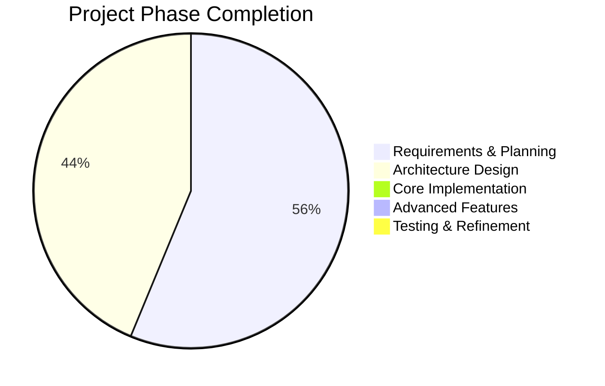
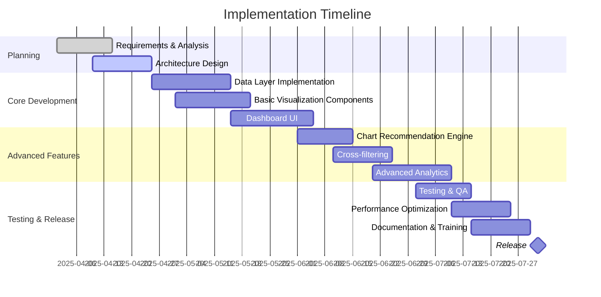

# Progress: Developer Performance Analytics Dashboard

## Current Status

The Developer Performance Analytics Dashboard project is currently in the **initial planning and architecture phase**. We are documenting the requirements, system architecture, and implementation approach before beginning development.

### Phase Completion

## What Works

As we are in the planning phase, no implementation has been completed yet. However, we have made significant progress in the following areas:

- ✅ **Project requirements** have been defined and documented
- ✅ **System architecture** has been designed and documented
- ✅ **Technology stack** has been selected
- ✅ **Data structure analysis** from the text-conversation-rewards module is in progress
- ✅ **Visualization strategy** has been outlined

## What's Left to Build

The entire implementation is pending. Here is a breakdown of what needs to be built:

### 1. Data Layer
- [ ] Supabase connection and authentication
- [ ] Data fetching and caching module
- [ ] Data transformation and normalization utilities
- [ ] Filtering and aggregation engine

### 2. Visualization Framework
- [ ] Chart configuration engine
- [ ] Dimension mapping system
- [ ] Chart type recommendation algorithm
- [ ] Base visualization components
- [ ] Responsive chart rendering

### 3. User Interface
- [ ] Dashboard layout and navigation
- [ ] Data dimension selection controls
- [ ] Filtering and time range selection
- [ ] Saved views and configurations
- [ ] Settings and preferences

### 4. Advanced Features
- [ ] Cross-filtering between visualizations
- [ ] Drill-down capabilities
- [ ] Export and sharing functionality
- [ ] Alerts and threshold notifications
- [ ] Custom metrics and calculations

### 5. Deployment & Infrastructure
- [ ] CI/CD pipeline
- [ ] Production environment setup
- [ ] Monitoring and error tracking
- [ ] Performance optimization
- [ ] Documentation for users

## Implementation Timeline

## Known Issues and Challenges

As we haven't started implementation, there are no code-related issues yet. However, we've identified several challenges that will need to be addressed:

1. **Data Volume**: The rewards data can become large over time, potentially causing performance issues with complex visualizations.

2. **Complex Data Structure**: The nested nature of the rewards data requires careful normalization and transformation for effective visualization.

3. **Dynamic Chart Selection**: Creating an algorithm that reliably selects the appropriate chart type for any combination of dimensions will be challenging.

4. **User Experience**: Balancing flexibility with usability to ensure engineering managers can easily derive insights.

5. **Performance Optimization**: Ensuring responsive performance, especially for interactive features like cross-filtering and drill-downs.

## Next Immediate Steps

1. Finalize the data structure analysis from the `text-conversation-rewards` module
2. Create detailed component specifications for the visualization framework
3. Set up the project repository with the selected technology stack
4. Implement a basic Supabase connection to fetch sample data
5. Develop proof-of-concept visualizations to validate the approach

## Future Considerations

- Adding machine learning capabilities for predictive analytics
- Integrating with other data sources beyond GitHub
- Creating a notification system for important metrics changes
- Developing custom visualizations for specific performance patterns
- Adding team-level aggregations and comparisons
