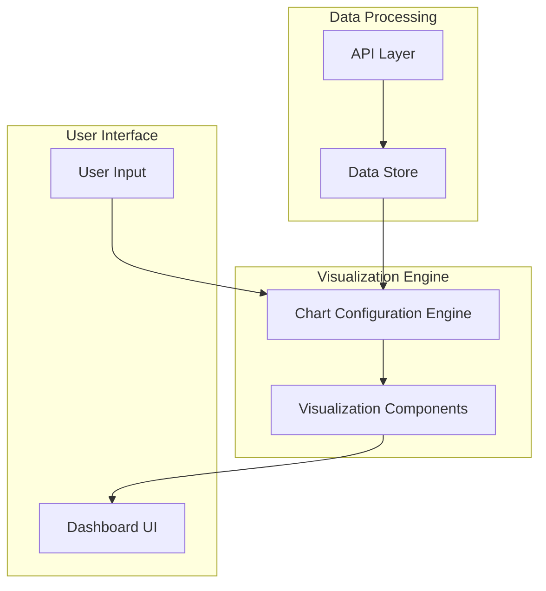
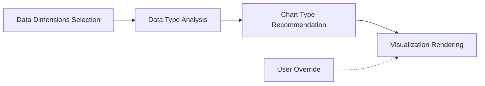
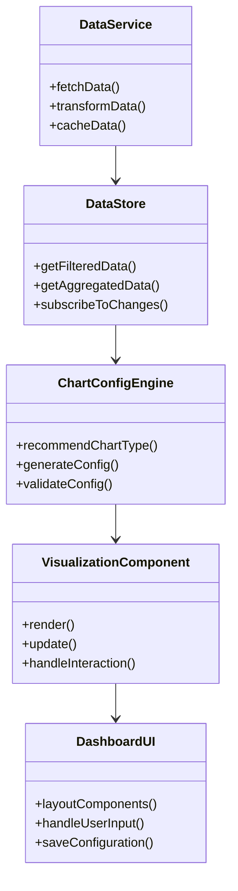
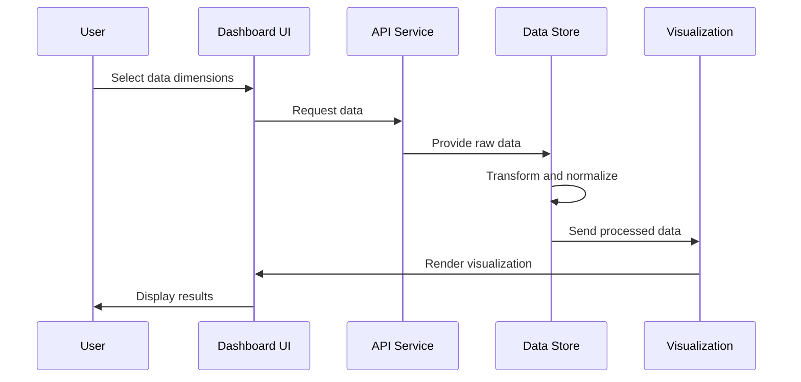
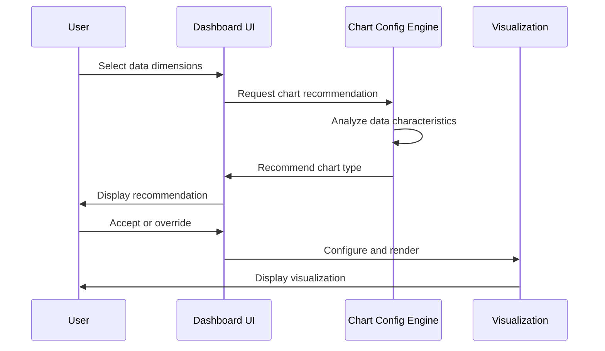

# System Patterns: Developer Performance Analytics Dashboard

## System Architecture

The Developer Performance Analytics Dashboard will follow a modular, component-based architecture to ensure flexibility, maintainability, and extensibility.

### Core Components

1. **API Layer**
   - Responsible for fetching data from Supabase
   - Handles authentication and API requests
   - Provides error handling and retry logic

2. **Data Store**
   - Normalizes and caches data from the API
   - Implements data transformation pipelines
   - Provides filtered and aggregated datasets to visualization components

3. **Chart Configuration Engine**
   - Analyzes data characteristics to suggest appropriate visualizations
   - Maps data dimensions to visual properties
   - Provides configuration options for charts

4. **Visualization Components**
   - Implements various chart types
   - Handles rendering and interactivity
   - Supports common visualization patterns (zooming, filtering, highlighting)

5. **Dashboard UI**
   - Provides layout and navigation
   - Implements user input controls
   - Manages dashboard state and configuration

## Key Technical Decisions

### 1. Data Flow Pattern

We will implement a unidirectional data flow pattern:
- Data flows from the API through the data store to visualization components
- User actions flow back through the configuration engine to update visualizations
- This approach minimizes side effects and makes the system more predictable

### 2. Smart Chart Selection

The system will implement a "chart recommendation engine" that:
- Analyzes the selected data dimensions
- Considers data characteristics (categorical vs. numerical, time series, etc.)
- Recommends appropriate visualization types
- Provides fallback options if the primary recommendation isn't suitable

### 3. Component Architecture

The visualization components will follow a composable architecture:
- Base visualization components for core chart types
- Higher-order components for adding features like filtering and drill-down
- Container components that connect to the data store
- This approach allows for component reuse and consistent behavior

### 4. State Management

The dashboard will use a centralized state management approach:
- Global state for user selections and dashboard configuration
- Local state for component-specific interaction
- Persistent state for saved user preferences

## Design Patterns

### 1. Adapter Pattern

Used to normalize data from the API into a consistent format for visualizations:
- Transforms raw API responses into standardized visualization data
- Handles edge cases and missing data
- Provides a consistent interface to visualization components

### 2. Strategy Pattern

Applied to chart selection and rendering:
- Different visualization strategies based on data characteristics
- Interchangeable rendering approaches (Canvas, SVG, WebGL)
- Dynamic strategy selection based on data size and complexity

### 3. Observer Pattern

Implemented for reactive updates:
- Components observe changes in the data store
- UI updates automatically when data or configuration changes
- Decouples data management from visualization

### 4. Factory Pattern

Used for creating visualization instances:
- Chart factories create appropriate visualization instances
- Configuration factories generate default settings based on data
- Ensures consistent initialization and configuration

## Component Relationships

## Data Flow Patterns

### 1. Initial Data Loading

### 2. Chart Type Selection

## Implementation Considerations

1. **Performance Optimization**
   - Implement lazy loading for visualizations
   - Use windowing for large datasets
   - Apply data aggregation for high-volume metrics

2. **Extensibility**
   - Design for easy addition of new chart types
   - Allow for custom metrics and dimensions
   - Support plugin architecture for extensions

3. **Responsiveness**
   - Implement responsive design patterns
   - Adapt visualizations to different screen sizes
   - Optimize for both desktop and tablet use cases

4. **Error Handling**
   - Graceful degradation when data is unavailable
   - Clear error states and recovery paths
   - Fallback visualization options
