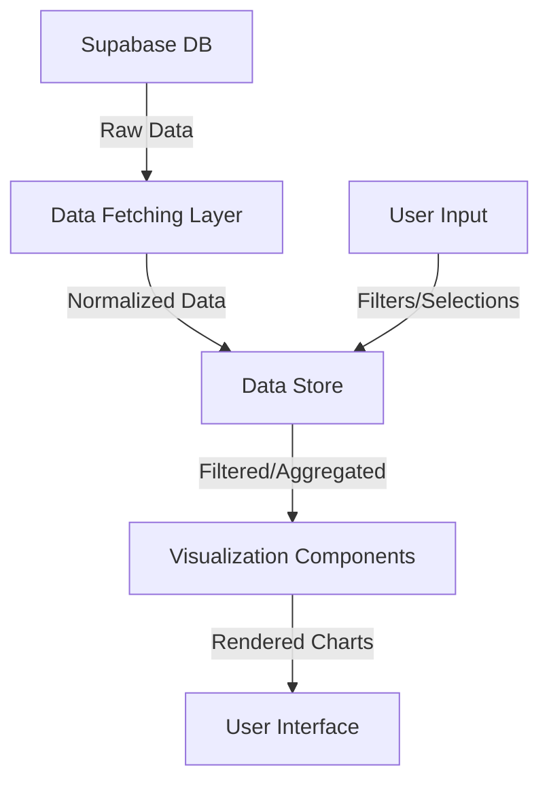

# Tech Context: Developer Performance Analytics Dashboard

## Technologies Used

The Developer Performance Analytics Dashboard will be built using the following technology stack:

### Frontend
- **React**: Core UI framework
- **TypeScript**: For type-safe code and better developer experience
- **D3.js**: Primary visualization library for custom charts
- **Recharts**: React-based charting library for standard visualizations
- **Redux Toolkit** or **React Context API**: For state management
- **Tailwind CSS**: For styling and responsive design
- **React Query**: For data fetching and cache management

### Backend
- **Supabase**: Database and authentication
- **Node.js**: For API layer if needed beyond direct Supabase client access
- **PostgreSQL**: Underlying database used by Supabase

### Development Tools
- **Bun**: JavaScript/TypeScript runtime and package manager
- **Vite**: Fast development server and build tool
- **ESLint/Prettier**: Code quality and formatting
- **Jest/React Testing Library**: Testing framework

## Development Setup

### Prerequisites
- Node.js 18+ or Bun 1.0+
- Supabase account and project
- Environment variables for connecting to Supabase

### Local Development
1. Environment setup:
   ```bash
   # Clone repository
   git clone [repository-url]
   cd developer-dashboard

   # Install dependencies
   bun install

   # Set up environment variables
   cp .env.example .env
   # Edit .env with your Supabase credentials
   ```

2. Development server:
   ```bash
   bun run dev
   ```

3. Testing:
   ```bash
   bun run test
   ```

4. Build:
   ```bash
   bun run build
   ```

## Technical Constraints

### Data Structure
- Must work with the existing data structure from `text-conversation-rewards` module
- Need to handle potentially large datasets efficiently
- JSON structure can be complex with nested properties

### API Limitations
- Supabase query limitations (size, complexity)
- Need to handle pagination for large result sets
- Need to implement efficient filtering and aggregation

### Browser Compatibility
- Support for modern browsers only (Chrome, Firefox, Safari, Edge)
- Mobile responsiveness required for tablet use cases
- Performance considerations for complex visualizations

### Performance Requirements
- Dashboard should load initial data within 2 seconds
- Chart rendering should be smooth (60fps) even with larger datasets
- Filter operations should respond within 500ms

## Dependencies

### External APIs
- **Supabase API**: Primary data source
- **GitHub API**: For additional context if needed

### Critical Libraries
- **D3.js**: For custom visualization components
- **date-fns**: For date manipulation and formatting
- **lodash**: For data manipulation utilities
- **react-router**: For dashboard navigation
- **i18next**: For internationalization

### Development Dependencies
- **TypeScript**: For type safety
- **ESLint**: For code quality
- **Jest**: For testing
- **Storybook**: For component development and documentation

## Data Flow



## Security Considerations

1. **Authentication**:
   - Use Supabase authentication
   - Role-based access control for different dashboard views
   - Secure handling of API keys and tokens

2. **Data Privacy**:
   - Consider anonymization options for sensitive metrics
   - Implement appropriate access controls for personal performance data
   - Follow data protection best practices

3. **API Security**:
   - Use secure API endpoints
   - Implement rate limiting
   - Validate and sanitize all inputs

## Deployment Strategy

1. **Environments**:
   - Development: For active development
   - Staging: For testing before production
   - Production: Live environment

2. **CI/CD**:
   - Automated testing on pull requests
   - Automated deployment to staging for merged PRs
   - Manual promotion to production

3. **Monitoring**:
   - Performance monitoring
   - Error tracking
   - Usage analytics

## Technical Challenges

1. **Data Visualization Performance**:
   - Handling large datasets efficiently
   - Optimizing rendering for complex charts
   - Maintaining responsive UI during data operations

2. **Dynamic Chart Type Selection**:
   - Creating an intelligent system to select appropriate chart types
   - Handling edge cases and fallbacks
   - Providing smooth transitions between chart types

3. **Data Aggregation**:
   - Implementing efficient algorithms for data aggregation
   - Balancing aggregation with granularity
   - Supporting drill-down functionality

4. **Cross-Filtering**:
   - Implementing coordinated views
   - Maintaining consistent state across multiple visualizations
   - Optimizing filter operations
